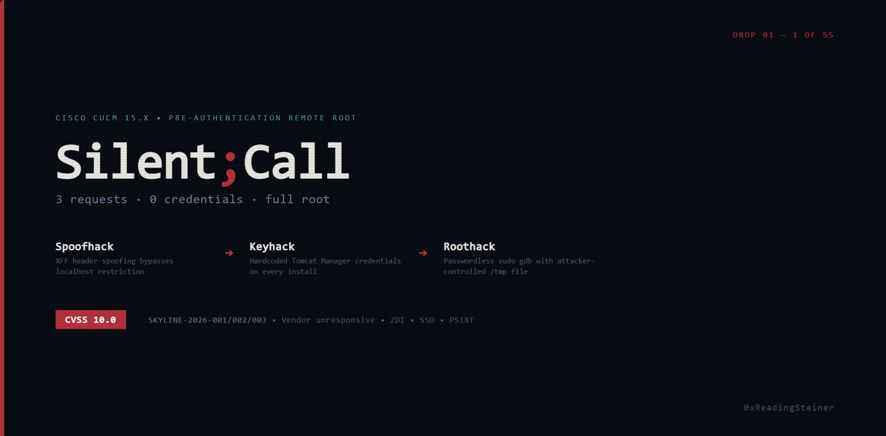

# Cisco Security Research

**Researcher:** 0xReadingSteiner
**Contact:** 0xReadingSteiner@proton.me
**Vendor:** Cisco Systems, Inc.
**Vendor Notified:** 2026-08-04 (Cisco PSIRT, ZDI, SSD)
**Vendor Response:** None

---

## Why This Exists

Independent security research on commercially available Cisco products has identified critical vulnerabilities across multiple product lines — including the systems enterprises rely on for voice communications, collaboration, and network security.

Multiple coordination attempts were made before publication:

- **17 submissions** to the Zero Day Initiative (ZDI) — unprocessed
- **SSD** paused all Cisco vulnerability acquisitions, stating Cisco won't address existing reports
- **Cisco PSIRT** contacted directly on 2026-08-04 — no response

Cisco's refusal to engage leaves enterprise defenders blind. These advisories exist so that organizations running Cisco infrastructure can assess their own risk and take protective action.

---

## Products Under Research

| Product | Role | Status |
|---------|------|--------|
| **Cisco Unified Communications Manager (CUCM) 15.x** | Enterprise voice call processing | Active — 55+ vulnerabilities identified |
| **Cisco Expressway** | Collaboration edge / VPN gateway | Active |
| **Cisco Firepower Threat Defense (FTD)** | Next-gen firewall / IPS | Upcoming |

---

## Kill Chains

Each advisory combines multiple vulnerabilities into a complete attack narrative.

### CUCM

| # | Name | Components | Summary | CVSSv3.1 | Date |
|---|------|------------|---------|----------|------|
| 01 | [**Silent;Call**](drops/01/ADVISORY.md) | Spoofhack → Keyhack → Roothack | Pre-authentication remote root — 3 HTTP requests, zero credentials | 10.0 | 2026-08-04 |

*Additional kill chains will be published weekly.*

---

## Individual Vulnerabilities

Each kill chain is composed of individual vulnerabilities, documented separately for CVE tracking.

### CUCM

| ID | Name | Title | CWE | Used In |
|----|------|-------|-----|---------|
| [SKYLINE-2026-001](vulns/SKYLINE-2026-001.md) | Spoofhack | X-Forwarded-For Header Trust Without Restriction | CWE-644 | Silent;Call |
| [SKYLINE-2026-002](vulns/SKYLINE-2026-002.md) | Keyhack | Hardcoded Tomcat Manager Credentials | CWE-798 | Silent;Call |
| [SKYLINE-2026-003](vulns/SKYLINE-2026-003.md) | Roothack | Multiple Unrestricted Sudo Privilege Escalation Paths | CWE-269 | Silent;Call |

---

## Coordination Timeline

See [TIMELINE.md](TIMELINE.md) for the full vendor coordination history.

---

## Legal

This research was conducted independently on commercially available software in a private laboratory environment. No proprietary source code, internal tools, or confidential information was used. All findings were reported to the vendor prior to publication.

The researcher is available for coordination with Cisco PSIRT, CERT/CC, CISA, or any affected organization.

---

## License

Advisory text is released under [CC BY 4.0](https://creativecommons.org/licenses/by/4.0/). PoC scripts are provided for defensive and educational purposes only.
